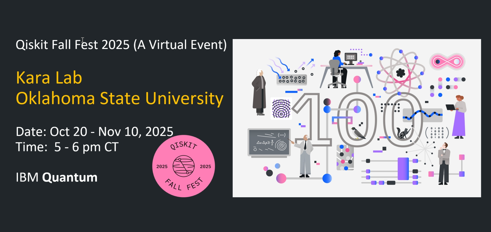

<link rel="stylesheet" href="assets/style.css">



{: .banner }

# Qiskit Fall Fest 2025 
## KARA Lab
## Oklahoma State University

> Virtual series • Mondays, **Oct 13 – Nov 3, 2025** • **5:00–6:00 PM CT**

Welcome to the event website! This site hosts slides, Google Colab notebooks, and mini-challenges for each session.

- 📖 **Schedule:** [View the weekly schedule](schedule.md)
- 💻 **Launch Colab (Session 1):** [Open 01_intro_qubits.ipynb](../notebooks/01_intro_qubits.ipynb)
- 📂 **Repository:** [github.com/kursatkara/qiskit-fall-fest-2025](https://github.com/kursatkara/qiskit-fall-fest-2025)
- 📜 **Code of Conduct:** [View](../CODE_OF_CONDUCT.md)

---

## Format
- 🎤 20-minute introduction to key concepts  
- 💻 40-minute guided Qiskit activity in Google Colab  
- 🧩 Short follow-up challenge due the next day  

## Who should attend?
Students, researchers, and developers in computational science and engineering who want a practical, hands-on introduction to quantum computing with Qiskit.

---

## Organizing Committee

- **Dr. Kursat Kara (Chair)** — Associate Professor, School of Mechanical & Aerospace Engineering  
- **Shafi Al Salman Romeo** — PhD Candidate  
- **Ashraf Kassem** — PhD Candidate  
- **Sabbir Hossain** — MSc Student  

- **Stevens Johnson** — PhD Student  
- **Geetha Karuppasamy** — PhD Student
