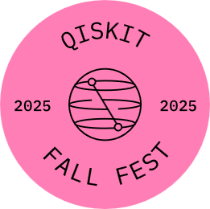

<!-- Load custom CSS -->
<link rel="stylesheet" href="assets/style.css">

<!-- Custom Branded Header (replaces theme header we hide via CSS) -->
<header class="brand-header">
  

    <a class="brand-left" href="{{ site.baseurl }}/">
      
      Qiskit Fall Fest 2025 — Oklahoma State University
    </a>
    

      
    

  

</header>

# Welcome

> Virtual series • Mondays, **Oct 13 – Nov 3, 2025** • **5:00–6:00 PM CT**

This site hosts slides, Google Colab notebooks, and mini-challenges for each session.

- 📖 **Schedule:** [View the weekly schedule](schedule.md)
- 💻 **Launch Colab (Session 1):** [Open 01_intro_qubits.ipynb](../notebooks/01_intro_qubits.ipynb)
- 📂 **Repository:** [github.com/kursatkara/qiskit-fall-fest-2025](https://github.com/kursatkara/qiskit-fall-fest-2025)
- 📜 **Code of Conduct:** [View](../CODE_OF_CONDUCT.md)

---

## Format
- 🎤 20-minute introduction to key concepts  
- 💻 40-minute guided Qiskit activity in Google Colab  
- 🧩 Short follow-up challenge due the next day  

## Who should attend?
Students, researchers, and developers in computational science and engineering who want a practical, hands-on introduction to quantum computing with Qiskit.

---

### Organizers
KARA Lab • School of Mechanical & Aerospace Engineering • Oklahoma State University
